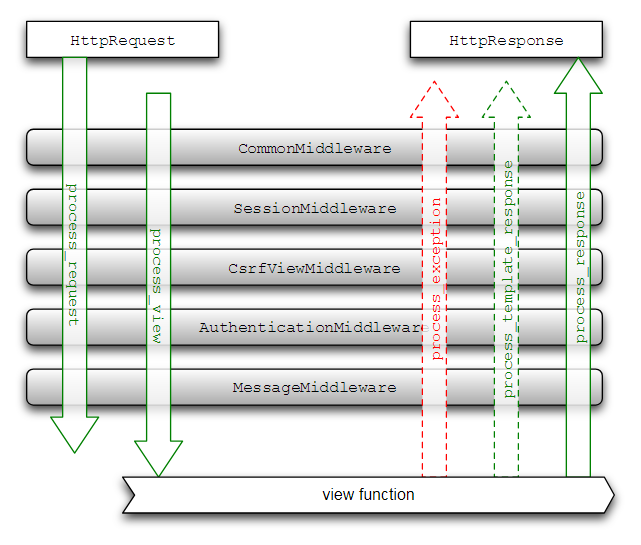

# middleware的配置
创建middleware.py在view所在的目录下


```python 
import time 
from django.urls import reverse
from django.utils.deprecation import MiddlewareMixin

class TimeItMiddleware(MiddlewareMixin):
	#中间件进入的第一个方法，一般情况下在这里做一些校验，比如ＨＴＴＰ中的
	#认证头之类的验证,返回值可以使httpresponse 或者none 
	#返回httpresponse -> 那么接下来只会处理process_response其他方法不会执行
	#返回none --> 继续执行其他ｄｅｆ
	# 如果在settings 中设置这个ｍｉｄｄｅｌｓｗａｒｅ在第一位置，那么其他的就不执行了
	def process_request(self,request):
		return
	#计算调用view所用的时间，process_request的方法调用后才会执行，func就是要执行的ｖｉｅｗ的方法
	def process_view(self,request,func,*args,**kwargs):
		if request.path != reverse('index'):
			return None
	    start = time.time()
	    response = func(request) 
	    costed = time.time()-start
	    print('process view:{:.2f}s'.format(costed))
	    return response
    #发生异常的时候执行的函数（调用view时，）
    def process_exception(self,request,exception):
    	pass
    # 执行完view后，套用模板的时候
    def process_template_response(self,request,response):
    	return response
    #　所有执行完毕后执行这个函数
    def process_response(self,request,response):
    	return response
```
## 在settings中添加middleware 的注册信息
```python
MIDDLEWARE = [
    'index.middleware.TimeItMiddleware'
]
```
