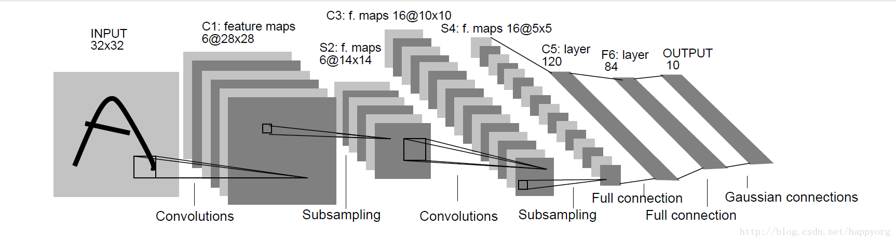

# **深度学习**<br/>
## 神经网络的基本步骤
1. 构造方法
2. 打印权重参数和偏置项
3. 预测输出
4. 更新权重参数和偏置项
5. 迭代一次
6. 训练
## 单层神经网络
用单层神经网络实现and运算（等于是一个简单的二分类）

x1|x2|y
-----|-----|-----
0|0|0
0|1|0
1|0|0
1|1|1

## 源码
```python
#-*- coding: utf-8 -*-
import numpy as np
import matplotlib.pyplot as plt
class Perceptron(object):

    '''
    单层神经网络 demo1   

    '''
    #1.构造方法
    def __init__(self,activator,input_vec):
        '''
        activator:激活函数
        input_vec:
        thetas:权重参数
        '''
        self.activator = activator
        self.input_vec = input_vec
        self.thetas = np.random.normal(0,0.01,size = (input_vec.shape[1],1))
        self.bias = 1

    #2.打印权重参数和偏置项
    def __str__(self):
        print("权重参数")
        print(self.thetas)
        print("偏置项")
        print(self.bias)
    #3.预测输出
    def predict(self,vec):
        '''
        计算一次迭代的预测值
        '''
        return(self.activator(np.sum(np.dot(vec,self.thetas)+self.bias)))
    #4.更新权重参数和偏置项
    def update_thetas(self,vec,output,lbl,rate):
        '''
        loss误差：预测值减去期望值
        lbl：期望值
        rate：学习速度，每一次迭代的步数，每次迭代的步长
        注意：这一步的作用时将正向传播的误差，反向传递给thetas（权重）和bias（偏置项） 
        '''
        loss = lbl-output
        self.thetas = list(map(lambda x:x[0]+x[1]*loss*rate,
            list(zip(self.thetas,vec))))
        self.bias+=loss*rate
    #5.迭代一次
    def one_iterator(self,lbls,rate):
        '''
        这一步的作用是：通过不断的迭代，反向传播，修正权重值和偏置项，以达到一个最好的模型参数
        '''
        samples = zip(self.input_vec,lbls)
        for vec,lbl in samples:
            output = self.predict(vec)
            self.update_thetas(vec,output,lbl,rate)	
    #6.训练
    def train(self,lbls,iteration,rate):
        '''
        lbls 预测期望值(正确的预测值) 
        iteration 迭代次数
        rate 学习速率
        '''
        for i in range(iteration):
            self.one_iterator(lbls,rate)

#1训练样本
'''
datas 是特征样本，这里有4个样本，2个特征，其中0表示预测假，1表示预测真
lbls  是给定的预测结果，与datas对应，比如当datas=[0.0]时，两个假==假事件，那么对应y的预测期望值也是0，同理[1,0]==真假 ，逻辑and运算为假
即y的预测期望为0，[1,1]==真真，y=1
'''
def createData():
    datas=[[0,0],[1,0],[0,1],[1,1]]
    lbls = [0,0,0,1]
    return datas,lbls
#2数据可视化
def viewData(datas,lbls):
    for lbl,dt in zip(lbls,datas):
        plt.plot(dt[0],dt[1],'o' if lbl else '^',mec = 'r' if lbl else 'b')
    plt.show()
#3激活函数
'''
神经元通过一次计算后的值并不是1或者0，我们需要一个函数（激活函数）对所计算的实际y值进行加工，使其变成1或0
'''
def f(x):
    return 1 if x>0 else 0


#运算过程如下：懒得打字了，自己看吧！哈哈哈相信你们看懂！！
ds,ls = createData()
x = np.array(ds)
p=Perceptron(f,x)
#这里的1000的意思时迭代了1000次！！还是打个字吧
p.train(ls,1000,0.1)
p.__str__()
x1=[1,1]
y1=p.predict(x1)
print(y1)
    
```
以上使用底层numpy实现的一个单层神经网络的二分类


# 用双层网络实现xor的逻辑
## BP算法
+ BP神经网络是1986年由Rumelhart和McClelland为首的科学家提出的概念
+ BP——back propagation，也就是逆向传播的意思，通俗的说就是：用模型得到的预测值与真实值之间的误差，来影响改变之前各层间的权重
  


## 先介绍几个符号代表的意思：（都是向量式）
+ X——输入值（数据项）；Y——真实值（标签项）
+ V——输入层连接隐藏层的权重；W——隐藏层连接输出层的权重
+ L1——隐藏层的值（输入层的值X经过权重V作用后的输出值）
+ L2——预测值（隐藏层的值L1经过权重W作用后的输出值，也就是模型预测值）

## **BP算法的工作流程：**
1. 输入值X经过权重V的作用，再通过激活函数处理，得到隐藏层的输入值L1
2. 同时L1也是隐藏层的输出值，L1经过权重W的作用，再经过激活函数处理，得到预测值L2
3. 用梯度下降法计算输出层的误差改变量：真实值Y与预测值L2之间的误差与L2的负梯度相乘，得到输出层的误差改变量L2_delta
4. 用梯度下降法计算隐藏层的误差改变量：用输出层的误差改变量L2_delta乘权重W再与L1的负梯度相乘，得到隐藏层的误差改变量L1_delta
5. 各层误差改变量与学习率相乘，再与各层原有权重相加，得到更新后权重V_、W_
6. 用更新后的权重V_、W_迭代计算，重复以上步骤，直到满足一定条件时，输出最后预测值
   
## **BP神经网络解决异或**
```python
#-*- coding: utf-8 -*-
#这个脚本参照https://blog.csdn.net/zzZ_CMing/article/details/79118894的博客，学习到了大神的精华，非常感谢！

import numpy as np

lr = 0.11        #学习速率

#输入数据分别:偏置值,x1,x2
X = np.array([[1,0,0],
              [1,0,1],
              [1,1,0],
              [1,1,1]])

#标签
Y = np.array([[0,1,1,0]])

# 权重初始化，取值范围-1到1
V = np.random.random((3,4))*2-1
W = np.random.random((4,1))*2-1
#print('输入层连接隐藏层的权值V：',V)
#print('隐藏层连接输出层的权值W：',W)

#定义sigmoid函数
def sigmoid(x):
    return 1/(1+np.exp(-x))
#定义sigmoid的导数
def dsigmoid(x):
    return x*(1-x)

#更新权重函数
def get_update():
    global X,Y,W,V,lr
    # L1：输入层传递给隐藏层的值；输入层3个节点，隐藏层4个节点
    # L2：隐藏层传递到输出层的值；输出层1个节点
    L1 = sigmoid(np.dot(X,V))
    L2 = sigmoid(np.dot(L1,W))

    # L2_delta：输出层的误差改变量
    # L1_delta：隐藏层的误差改变量
    L2_delta = (Y.T - L2)*dsigmoid(L2)
    L1_delta = L2_delta.dot(W.T)*dsigmoid(L1)

    # W_C：输出层对隐藏层的权重改变量
    # V_C：隐藏层对输入层的权重改变量
    W_C = lr * L1.T.dot(L2_delta)
    V_C = lr * X.T.dot(L1_delta)

    # 更新后的权重
    W = W + W_C
    V = V + V_C

def main():
    for i in range(100000):
        get_update()
        if i%500 == 0:
            L1 = sigmoid(np.dot(X, V))
            L2 = sigmoid(np.dot(L1, W))
            print('当前误差',np.mean(np.abs(Y.T - L2)))
    L1 = sigmoid(np.dot(X, V))
    L2 = sigmoid(np.dot(L1, W))
    print('最后逼近值：',L2)

if __name__ == "__main__":
    main()

```


# 利用卷积神经网络（CNN）Lenet-5预测手写字体

## 准备工作
1. 安装tensorflow
2. 下载数据
   1. 训练数据 ---> /Lenet-5/dataset/mnist/train*
   2. 测试数据 ---> /Lenet-5/dataset/mnist/t10*
   3. 说明：
      1. 训练数据是55000张手写的0~9的数字图像
      2. 测试数据是10000张.....数据
3. Lenet-5结构

## Lenet-5神经网络的结构
**卷积神经网络的主要组成：**
1. 卷积层（Convolutional layer），卷积运算的目的是提取输入的不同特征，第一层卷积层可能只能提取一些低级的特征如边缘、线条和角等层级，更多层的网络能从低级特征中迭代提取更复杂的特征。
2. 池化层（Pooling），它实际上一种形式的向下采样。有多种不同形式的非线性池化函数，而其中最大池化（Max pooling）和平均采样是最为常见的
3. 全连接层（Full connection）, 与普通神经网络一样的连接方式，一般都在最后几层
4. Pooling层相当于把一张分辨率较高的图片转化为分辨率较低的图片；pooling层可进一步缩小最后全连接层中节点的个数，从而达到减少整个神经网络中参数的目的。

## Lenet-5结构

## **LeNet-5中主要有2个卷积层、2个下抽样层（池化层）、3个全连接层3种连接方式**


# 代码写起来！
# 1. 数据处理
```python
"""
    导入库
"""
from tensorflow.examples.tutorials.mnist import input_data
import matplotlib.pyplot as plt
import numpy as np

"""
    数据加载
    one-hot:热编码,
"""
def loadData(filename):
    #用独热编码加载mnist数据，独热编码的意思是对标签进行01编码，真为1其他为0
    mnist=input_data.read_data_sets(filename,one_hot=True)
    #准确的悬链数据标签 cls是真实的确定的数据
    mnist.train.cls=np.argmax(mnist.train.labels,axis=1)
    #用来验证的数据集，模型训练好了用这个来验证模型性能
    mnist.validation.cls = np.argmax(mnist.validation.labels, axis=1)
    #用来测试模型正确性
    mnist.test.cls = np.argmax(mnist.test.labels, axis=1)
    return mnist


#测试输出的数据
mnist=loadData('../../dataset/mnist')
print(mnist.train.images[0])
```
# 2. tensorflow上训练模型
```python
"""
 构建训练模型:LeNet5
 对数据进行训练
 并对训练的结果进行性能评估
"""
# 输入层,输出层
input_x=tf.placeholder(dtype=tf.float32,shape=[None,784])
input_img=tf.reshape(input_x,shape=[-1,28,28,1])
output_y=tf.placeholder(dtype=tf.float32,shape=[None,10])
output_cls=tf.argmax(output_y,dimension=1)

# 卷积层1
"""
 32个5*5大小的卷积核
 卷积运算:same
 激活函数:relu
 输出:32个28*28的矩阵
"""
conv1=tf.layers.conv2d(inputs=input_img,  # 输入数据
                       filters=32,        # 卷积核的数量
                       kernel_size=[5,5], # 卷积核的大小
                       padding='same',    # 卷积运算的方式
                       activation=tf.nn.relu) #激活函数
# 池化层1
"""
  池化核:2*2最大值池化
  输出:32个14*14
"""
pool1=tf.layers.max_pooling2d(inputs=conv1,
                              pool_size=[2,2],
                              strides=2)


# 卷积层2
"""
 64个5*5大小的卷积核
 卷积运算:same
 激活函数:relu
 输出:64个14*14的矩阵
"""
conv2=tf.layers.conv2d(inputs=pool1,  # 输入数据
                       filters=64,        # 卷积核的数量
                       kernel_size=[5,5], # 卷积核的大小
                       padding='same',    # 卷积运算的方式
                       activation=tf.nn.relu) #激活函数
# 池化层2
"""
  池化核:2*2最大值池化
  输出:64个7*7
"""
pool2=tf.layers.max_pooling2d(inputs=conv2,
                              pool_size=[2,2],
                              strides=2)

#扁平化pool2 7*7*64结果,目的是为了进行全连接运算
flat=tf.reshape(pool2,shape=[-1,7*7*64])

#定义全连接的神经元
#全连接层1
full1=tf.layers.dense(inputs=flat,units=1024,
    activation=tf.nn.relu
    )
#防止过拟合，1.数据增强 2.正则化 3.降采样rate=0.4 40%的不用链接
dp=tf.layers.dropout(inputs=full1,rate=0.4)

#结果层全连接层2
'''
最后输出的0～9数字的概率，输出多分类的结果
多分类使用softmax激活函数
对于二分类来说，则使用sigmoid激活函数
'''
full2=tf.layers.dense(inputs=dp,units=10,)
#表示0到9的概率有多大
#归一化
logit=tf.nn.softmax(full2)
#预测类别
pred=tf.argmax(logit,dimension=1)

#利用交叉熵定义损失函数
cross=tf.nn.softmax_cross_entropy_with_logits(labels=output_y,logits=logit)
cost = tf.reduce_mean(cross)#损失均值


#优化 随机梯度下降 (反向传播优化)
train=tf.train.AdamOptimizer(learning_rate=1e-4).minimize(cost)

#性能评估：预测的准确率
#布尔类型
corr_pred=tf.equal(output_cls,pred)
#转换类型acc就是预测的结果，以概率的形式反应回来
acc = tf.reduce_mean(tf.cast(corr_pred,tf.float32))
#保存训练模型
save_dir='checkpoint/'
if not os.path.exists(save_dir):
    os.makedirs(save_dir)
save_path = os.path.join(save_dir,'besetmodel')
#模型保存对象
saver=tf.train.Saver()

#训练的批次大小--64--（每次训练要拿多少数据来训练）
batch_size = 64

def opt(num_iter):
    #定义训练方法
    '''
    训练过程
    num_iter : 更新迭代的次数
    return：无返回
    '''
    session=tf.Session()
    #训练模型初始化
    session.run(tf.global_variables_initializer())
	#定义最优准确率
    best_acc=0

    for i in range(num_iter):
        #产生参与训练的样本
        x_batch,y_batch=mnist.train.next_batch(batch_size)
        #执行优化与性能评估　ac 表示每次迭代更新的预测准确率，　_,表示不关心输出是啥
        _,ac=session.run([train,acc],feed_dict={input_x:x_batch,output_y:y_batch})
        #
        if i%100==0:
            print('迭代次数:{0},准确率：{1}'.format((i+1),ac))
        if ac>best_acc :
            best_acc=ac
            saver.save(sess=session,save_path=save_path)

    #用已经训练好的模型测试输出，测试集第一个样本的标签
    pred_test = session.run(pred,feed_dict={input_x:mnist.test.images[:1]})
    print(pred_test)
    print('正确标签:{0}'.format(mnist.test.cls[:1]))

opt(num_iter=1000)

```
## **最后模型的参数会保存在checkpoint中**


# inception v3模型的应用
Inception为Google开源的CNN模型，至今已经公开四个版本，每一个版本都是基于大型图像数据库ImageNet中的数据训练而成。因此我们可以直接利用Google的Inception模型来实现图像分类。本篇文章主要以Inception_v3模型为基础。Inception v3模型大约有2500万个参数，分类一张图像就用了50亿的乘加指令。在一台没有GPU的现代PC上，分类一张图像转眼就能完成。

## 模型的使用

## demo_inceptionv3.py
```python
'''
导入所需的库
ｔｅｎｓｏｒｆｌｏｗ
inception.py

'''
import tensorflow as tf
import inception as inception

#导入inception 模型
model = inception.Inception()
#定义要识别的图像  bannel是一根香蕉
pred=model.classify(image_path='images/bannel.jpg')
#模型预测--->这里ｋ是打印模型认为最像的１０种可能
model.print_scores(pred=pred,k=10,only_first_name=True)
```
## 预测的结果
```shell
99.18% : banana
 0.03% : orange
 0.01% : fig
 0.01% : pineapple
 0.01% : lemon
 0.01% : zucchini
 0.01% : corn
 0.01% : butternut squash
 0.01% : spaghetti squash
 0.01% : Granny Smith

```
**以上内容将有利于接下来的迁移学习**

# 利用inception V3 进行迁移学习 
