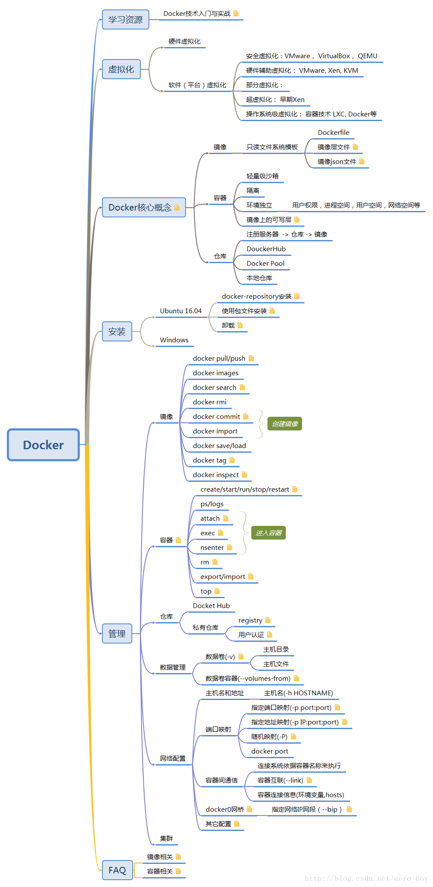

#docker
##常用基本指令
1. 下载镜像
   1. docker search ubuntu18.04 --> **查找ubuntu18.04的镜像**
   2. docker pull ubuntu18.04 --> **下载ubuntu18.04的镜像**

2. 进入镜像
   1. 直接进入
      1. docker run -it 镜像名(ubuntu) 
      2. 一系列操作
      3. exit --> 退出**此时会返回一个镜像id**
      4. docker start -i **容器ID/名称**
   
   2. 保存上述操作 
      1. docker commit **容器ID/容器名称（sdwq3fsdff）**  镜像名称(ubuntu)
   3. 自定义容器名字运行容器
      1. docker run --name =自定义名 -it IMAGE /bin/bash

3. 查看已知镜像
   1. docker image ls --> **查看镜像名称**
   2. docker ps -a --> **查看所有容器**
   3. docker ps -l -->**查看最近运行的容器** 
   4. docker inspect 容器ID -->**返回配置信息**

4. 后台运行docker容器（长期运行的程序）
   1. docker run -d **容器名称(filetest)** 
   2. docker run -it **容器名称(filetest)** ctrl +p ctrl +q
   3. 查看此时运行的docke容器 --> docker ps
   4. 继续运行已经工作的容器 
      1. docker attach 容器ID或者名称
5. 删除已经停止的容器
   1. docker rm 容器ID
6. 查看在容器中干了什么
   1. docker logs 容器名称
   2. docker top --> 运行中容器的进程情况
   3. docker exec [-d][-i][-t] 容器名[command][ARG] docker exec -it 容器名 /bin/bash
7. 停止已经运行的容器
   1. docker kill 容器名
   2. docker stop 容器名
8. 用dockerfile构建镜像
   1. docker bulid Dockerfile -t='镜像名称' .-->(Dockerfile的路径) 
9. Dockerfile的命令集
   1. 注释 #注释信息
   2. FROM<image>:<tag> #从哪个基础镜像来的
      1. FROM ubuntu：18.04
   3. MAINTAINER #此文件的各种信息
      1. MAINTAINER liyuan3970 "857956255@qq.com"
   4. RUN 镜像中运行的命令
      1. RUN apt-get install ncl 
   5. EXPOSE #暴露的端口号
      1. EXPORT 80 #开了也没用，要手动开如下
      2. docker run -p80 -d dormancypress/df_test1 nginx -g "daemon off;"
   6. 制定容器运行时的命令
      1. CMD 容器运行的默认行为
      2. ENTERYPOINT 
   7. 设置镜像的目录和文件
      1. ADD 加载文件
      2. COPY 加载文件 
      3. VOLUME["/data"] 共享数据
   8. 镜像构建和环境运行时的设置
      1. WORKDIR 制定命令工作目录
      2. ENV 设置环境变量
      3. USER 制定镜像用户
   9. ONBUILD #触发器的指令 子镜像构建的时候使用
10. 
##知识点总结

